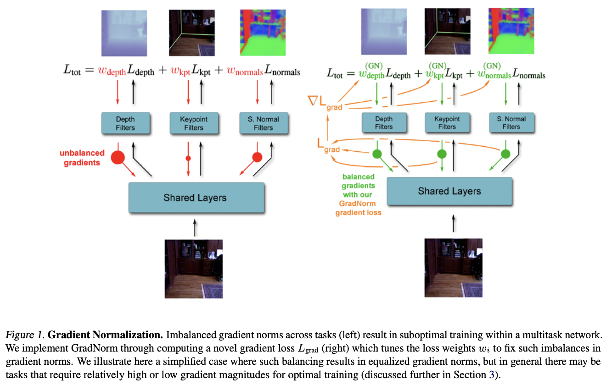

</img>

## GradNorm - Pytorch

A practical implementation of <a href="https://arxiv.org/abs/1711.02257">GradNorm</a>, Gradient Normalization for Adaptive Loss Balancing, in Pytorch

Increasingly starting to come across neural network architectures that require more than 3 auxiliary losses, so will build out an installable package that easily handles loss balancing in distributed setting, gradient accumulation, etc. Also open to incorporating any follow up research; just let me know in the issues.

Will be dog-fooded for <a href="http://github.com/lucidrains/audiolm-pytorch">SoundStream</a>, <a href="https://github.com/lucidrains/magvit2-pytorch">MagViT2</a> as well as <a href="https://github.com/lucidrains/metnet-3">MetNet3</a>

## Appreciation

- <a href="https://stability.ai/">StabilityAI</a>, <a href="https://a16z.com/supporting-the-open-source-ai-community/">A16Z Open Source AI Grant Program</a>, and <a href="https://huggingface.co/">🤗 Huggingface</a> for the generous sponsorships, as well as my other sponsors, for affording me the independence to open source current artificial intelligence research

## Install

```bash
$ pip install gradnorm-pytorch
```

## Usage

```python
import torch

from gradnorm_pytorch import (
    GradNormLossWeighter,
    MockNetworkWithMultipleLosses
)

# a mock network with multiple discriminator losses

network = MockNetworkWithMultipleLosses(
    dim = 512,
    num_losses = 4
)

# backbone shared parameter

backbone_parameter = network.backbone[-1].weight

# grad norm based loss weighter

loss_weighter = GradNormLossWeighter(
    num_losses = 4,
    learning_rate = 1e-4,
    restoring_force_alpha = 0.,                  # 0. is perfectly balanced losses, while anything greater than 1 would account for the relative training rates of each loss. in the paper, they go as high as 3.
    grad_norm_parameters = backbone_parameter
)

# mock input

mock_input = torch.randn(2, 512)
losses, backbone_output_activations = network(mock_input)

# backwards with the loss weights
# will update on each backward based on gradnorm algorithm

loss_weighter.backward(losses, retain_graph = True)

# if you would like to update the loss weights wrt activations just do the following instead

loss_weighter.backward(losses, backbone_output_activations)
```

You can also switch it to basic static loss weighting, in case you want to run experiments against fixed weighting.

```python
loss_weighter = GradNormLossWeighter(
    loss_weights = [1., 10., 5., 2.],
    ...,
    frozen = True
)

# or you can also freeze it on invoking the instance

loss_weighter.backward(..., freeze = True)
```

For use with <a href="https://huggingface.co/">🤗 Huggingface Accelerate</a>, just pass in the `Accelerator` instance into the keyword `accelerator` on initialization

ex.

```python
accelerator = Accelerator()

network = accelerator.prepare(network)

loss_weighter = GradNormLossWeighter(
    ...,
    accelerator = accelerator
)

# backwards will now use accelerator
```

## Todo

- [x] take care of gradient accumulation
- [ ] handle sets of loss weights
- [ ] handle freezing of some loss weights, but not others
- [ ] allow for a prior weighting, accounted for when calculating gradient targets

## Citations

```bibtex
@article{Chen2017GradNormGN,
    title   = {GradNorm: Gradient Normalization for Adaptive Loss Balancing in Deep Multitask Networks},
    author  = {Zhao Chen and Vijay Badrinarayanan and Chen-Yu Lee and Andrew Rabinovich},
    journal = {ArXiv},
    year    = {2017},
    volume  = {abs/1711.02257},
    url     = {https://api.semanticscholar.org/CorpusID:4703661}
}
```
